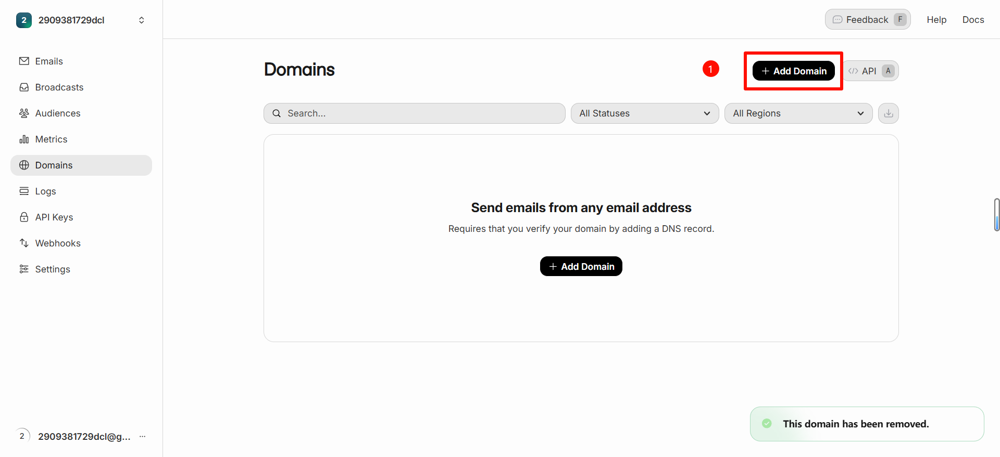
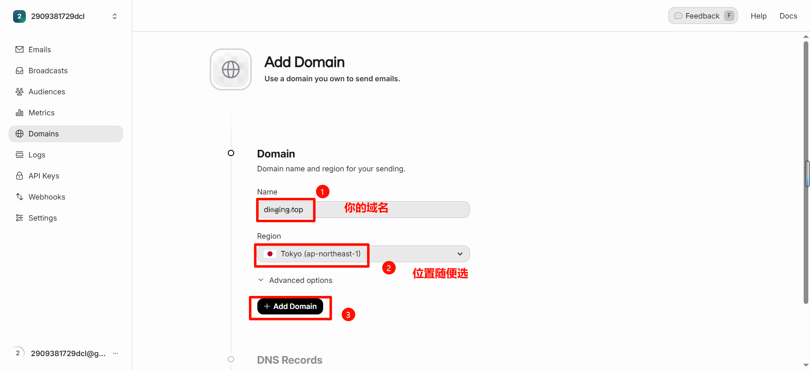
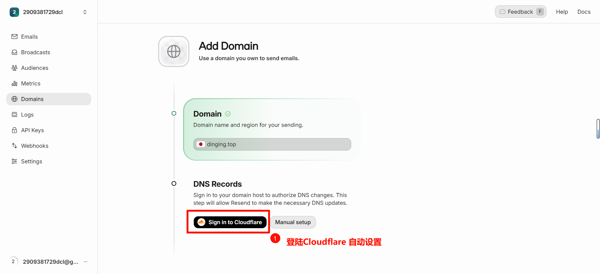
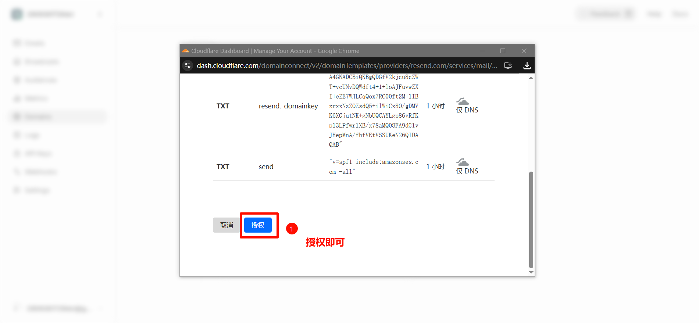
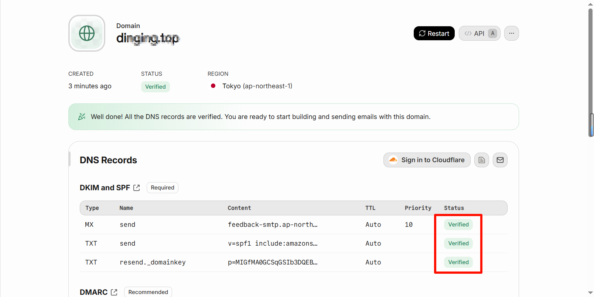
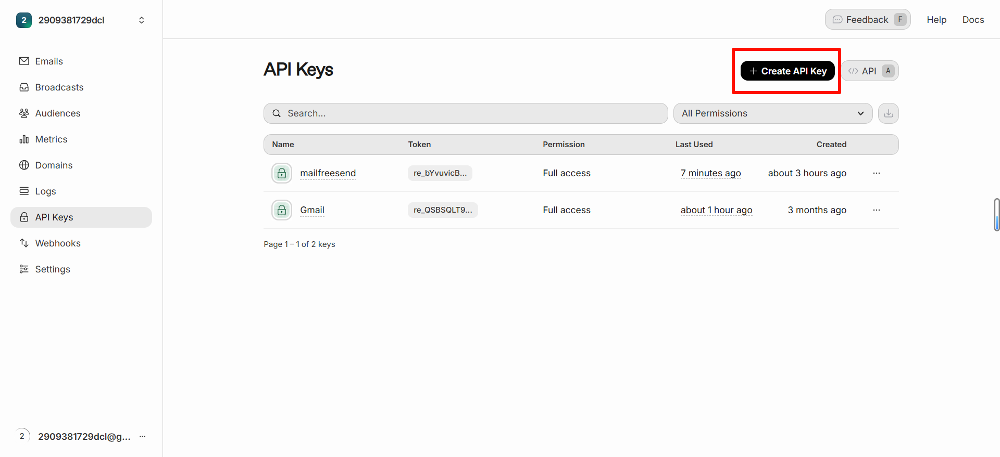
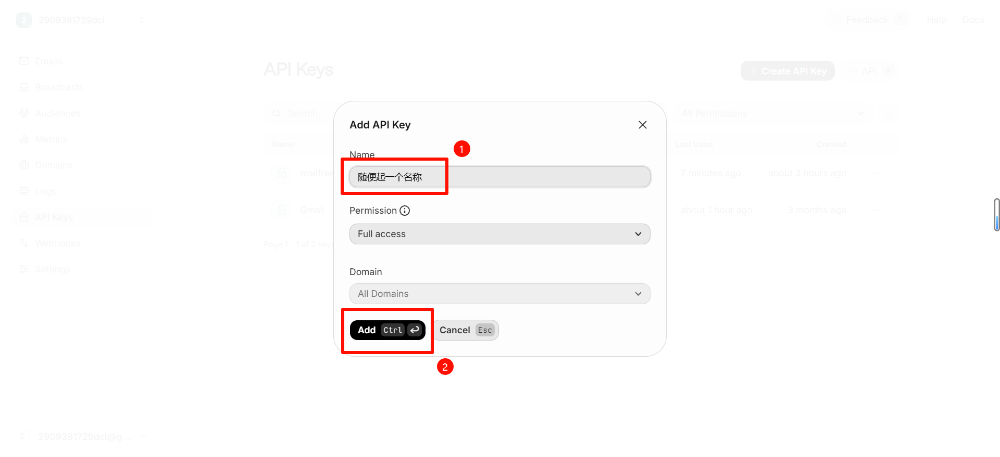
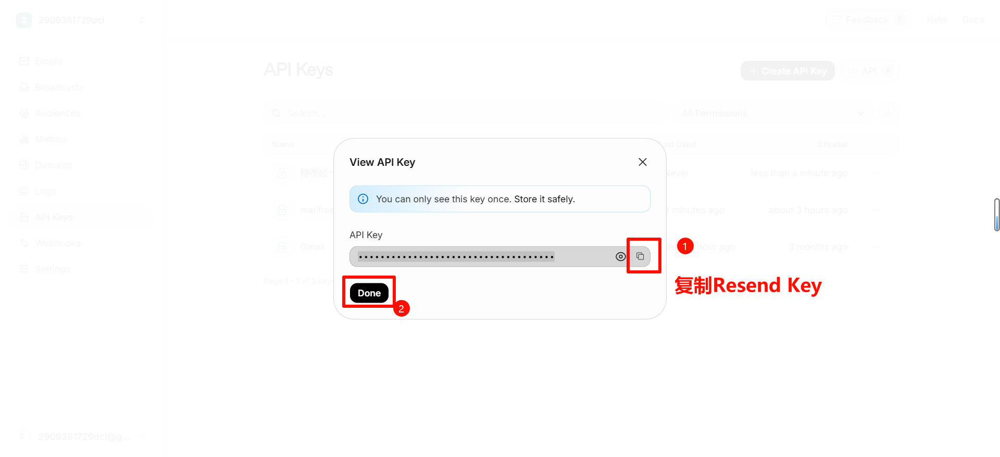

# 使用 Resend 发送邮件（密钥获取与配置教程）

本项目支持通过 Resend 提供的 API 进行发件（发件箱）。本文档介绍从申请密钥、绑定域名到在 Cloudflare Workers 中配置的完整流程。

> 代码读取的环境变量优先级：`RESEND_API_KEY` > `RESEND_TOKEN` > `RESEND`。推荐使用 `RESEND_API_KEY`。

## 1. 在 Resend 绑定并验证发信域名

- 登录 Resend 后台，进入 Domains，点击 Add Domain。
- 按向导添加你的发件域名，并在 DNS 处添加相应记录，待验证通过。

示意图（流程参考）：











完成后，确保域名状态为 Verified。发件地址必须使用该已验证域名，例如：`no-reply@yourdomain.com`。

## 2. 创建 Resend API Key

- 进入 Resend → API Keys，点击 Create API Key。
- 建议选择可读写权限（Emails: send/read/update），并妥善保存生成的 Key。

参考截图：







## 3. 在 Cloudflare Workers 配置变量

本项目运行在 Cloudflare Workers，需把密钥配置为 Secret，域名配置为普通变量。

方式一：命令行（Wrangler）

```bash
# 设置 Resend 密钥（Secret）
wrangler secret put RESEND_API_KEY
# 或者使用下面同义变量（不推荐）：RESEND_TOKEN / RESEND 

# 设置普通变量（可写入 wrangler.toml 的 [vars]）
# 多域名用逗号/空格分隔
# 例：MAIL_DOMAIN="iding.asia, example.com"
```

方式二：Dashboard（Git 集成部署常用）
- 进入 Cloudflare Dashboard → Workers → 选中你的 Worker → Settings → Variables。
- 在 Secrets 添加 `RESEND_API_KEY`。
- 在 Variables 添加 `MAIL_DOMAIN`，值为你用于收取/发件的域名列表（需与 Resend 已验证域名一致）。

## 4. 关联项目并部署

```bash
# 本地开发
wrangler dev

# 正式部署
wrangler deploy
```

确保 `wrangler.toml` 已绑定 D1 数据库与静态资源（仓库已配置）。

## 5. 前端使用发件功能（发件箱）

- 在首页先生成或选择一个邮箱地址。
- 点击“发邮件”，填写收件人、主题与内容，点击发送。
- 后端会调用 Resend API 发出邮件，并在数据库记录，前端可在“发件箱”查看记录与详情。

注意：
- 发件地址为当前选中邮箱（形如 `xxx@你的域名`）。你的域名需在 Resend 已验证。
- 若返回 `未配置 Resend API Key`，说明没有设置或没有以 Secret 形式提供 `RESEND_API_KEY`。

## 6. 常见问题

- 403/Unauthorized：域名未验证或 From 与已验证域名不一致。
- 429/限流：短时间大量请求，稍后重试或开启队列。
- 中文/HTML 内容：本项目会将 HTML 直接提交给 Resend，同时自动生成纯文本版本，提升兼容性。

## 7. 相关后端接口

- `POST /api/send` 发送单封邮件
- `GET /api/sent?from=xxx@domain` 获取发件记录列表
- `GET /api/sent/:id` 获取发件详情
- `DELETE /api/sent/:id` 删除发件记录

以上接口由 `src/apiHandlers.js` 与 `src/emailSender.js` 实现，调用 Resend REST API 完成发件/查询/取消等操作。
