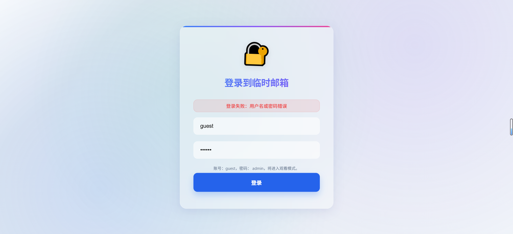
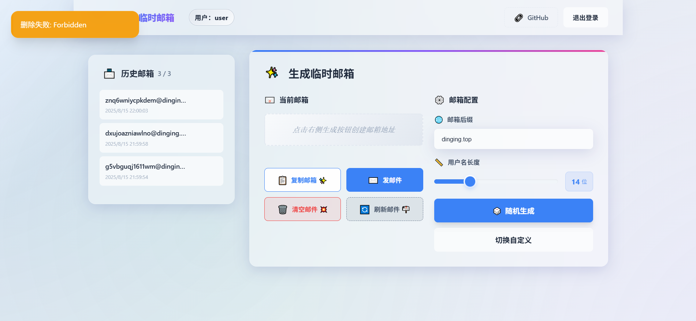

## V3 版本更新日志

### 简介
V3 版本围绕“账户体系 + 管理后台 + 权限与体验”进行重构与增强，新增用户登录系统、三层权限模型、统一风格的管理后台二级页面，以及更完善的错误提示与演示模式。

### 关键更新

#### 1) 账户与权限
- **三层权限**：
  - **严格管理员**（ENV: `ADMIN_NAME`，默认 `admin`）：可登录后台、查看全量邮箱；其置顶为“用户级”并互不干扰；具备最高操作权限。
  - **高级用户**（数据库 `role=admin`）：仅能管理分配给自己的邮箱，默认上限 20，默认允许发信；不可访问用户管理后台入口。
  - **普通用户**（数据库 `role=user`）：最低权限，默认上限 10，默认不允许发信；删除邮箱会提示“没权限删除”。
- 登录接口会在返回体与 JWT 中携带 `role`、`userId`、`can_send`、`mailbox_limit` 等字段，前端据此进行 UI 呈现与权限控制。

#### 2) 管理后台（Admin）
- 用户列表：
  - 操作区精简为“邮箱”“编辑”两按钮；
  - 新增“能否发件”列；
  - 列宽优化以完整显示“创建时间”；
  - “刷新”按钮移到“用户列表”标题栏最右侧。
- 编辑用户（自定义二级页面/模态）：
  - 表单栅格化布局，标题处显示当前用户名；
  - “角色”“允许发件”改为勾选开关；
  - 新增“更新用户”手动保存、“重置密码”“修改用户名”；
  - 底部按钮固定可见，点击空白可关闭（不保存）；
  - 删除用户采用自定义确认框。
- 分配邮箱：支持一次性输入多行邮箱地址进行批量分配（每行一个）。

#### 3) 首页体验
- 历史邮箱标题旁显示配额：`已用 / 总数`（来自 `/api/user/quota`）。
- 置顶（📍/📌）：
  - 置顶状态改为**用户级**（表 `user_mailboxes.is_pinned`），不同用户互不影响；
  - 严格管理员与普通/高级用户均可对“自己绑定的邮箱”置顶；
  - 列表按置顶优先、再按时间排序。
- 删除权限：普通用户删除返回“没权限删除”，前端 toast 清晰提示。
- 角色徽标：在顶部展示“普通用户/高级用户/超级管理员”状态与用户名。
- 管理入口：仅严格管理员和访客演示模式可见。

#### 4) 演示/Mock 模式
- 使用内置 `MOCK_DOMAINS` 生成演示邮箱，不调用真实 API 域名；
- 初始化生成多个演示用户，并为每个用户生成多条邮箱，便于展示历史列表与置顶交互。

#### 5) 错误与交互
- 达到邮箱上限时，`/api/generate` 与 `/api/create` 返回 400，前端改为警告提示而非成功；
- 普通用户删除邮箱返回 403 并提示“没权限删除”。

### 相关配置
- `ADMIN_NAME`：严格管理员用户名（默认 `admin`）。
- `ADMIN_PASSWORD`：严格管理员密码。
- `MAIL_DOMAIN`：可配置多个域名（逗号/空格分隔）。

### 截图
> 以下为对应功能的界面展示：

### 主要涉及文件
- 前端：`public/app.js`、`public/admin.html`、`public/admin.css`、`public/admin.js`、`public/templates/app.html`
- 后端：`src/server.js`、`src/apiHandlers.js`、`src/database.js`

### 备注
- 若从旧版本升级，首次运行会自动迁移需要的字段（如 `user_mailboxes.is_pinned`）。
- 若从旧版本升级，报错无法加载等等，尝试重置D1数据库

