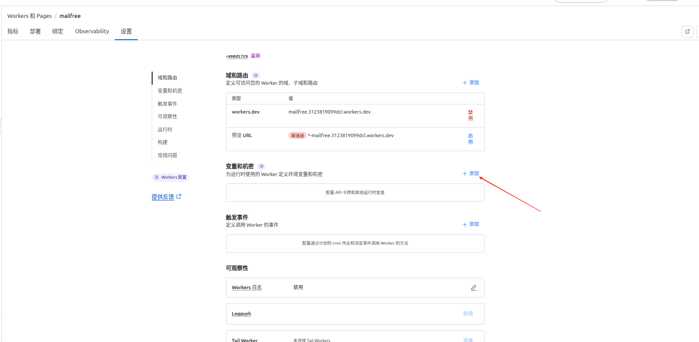
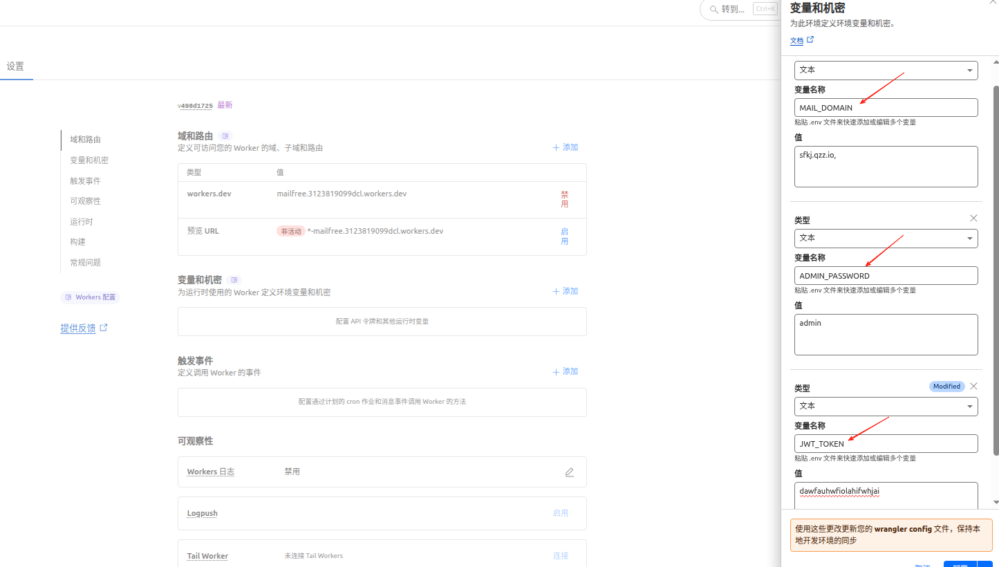
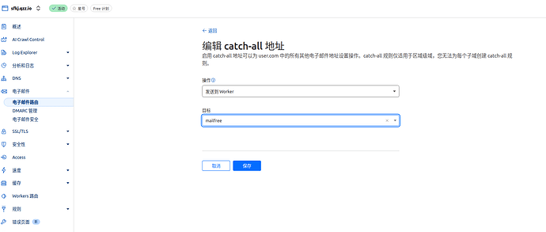

## 一键部署指南

#### 1. 首先点击  Deploy to Cloudflare

#### 2 登陆账号后会进入，推荐选择亚洲地区（当然不选择亚洲也没关系）
`不要修改数据库名称和R2名称 可能导致无法查询`

#### 3. 点击创建部署，然后耐心等待克隆部署

#### 4. 点击继续处理项目，绑定必须的环境变量

#### 5. 添加完成后点击部署即可

    `注：这三个变量是必须的，其他变量例如 管理员名称，发邮件密钥可自行决定是否添加`

    最后就可以打开对应的worker连接登陆了

#### 6. 默认管理员账号为 admin

#### 7. 记得将域名邮箱的catch-all 绑定到worker上（不绑定无法接收到邮件）

