### Loading
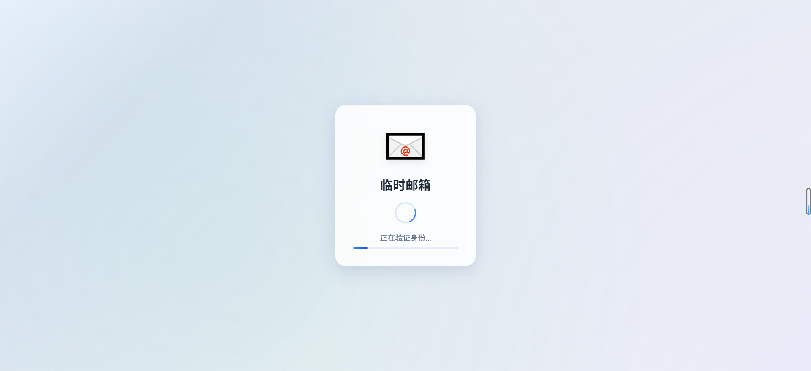
### 首页
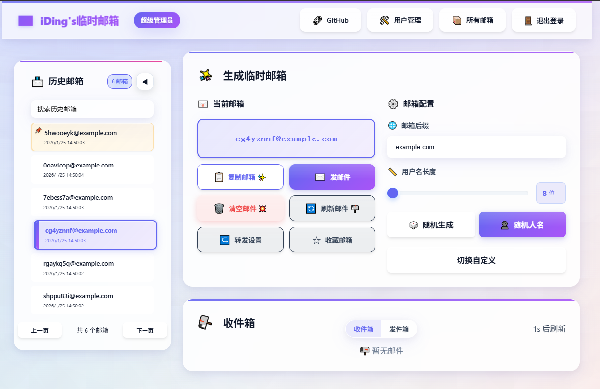

### 用户登陆
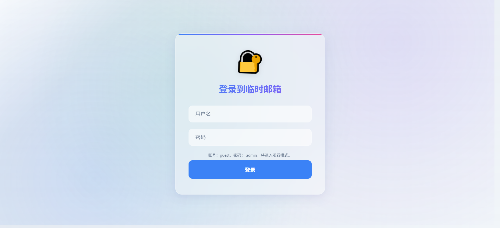

### 邮件内容查看（HTML 渲染）
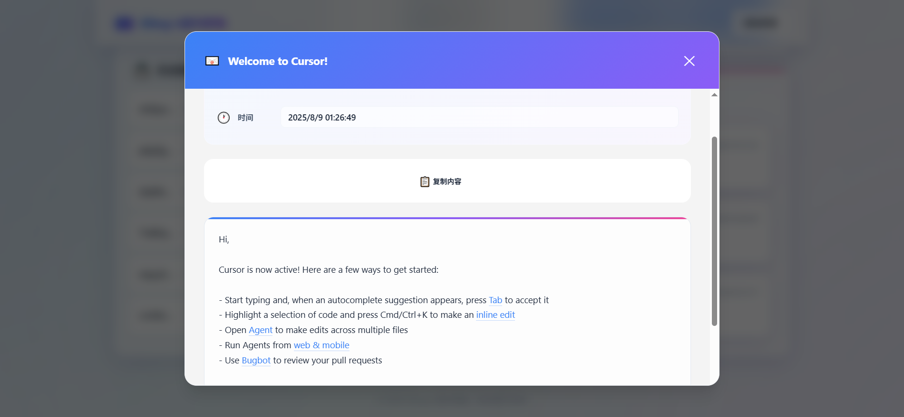

### 便捷复制验证码
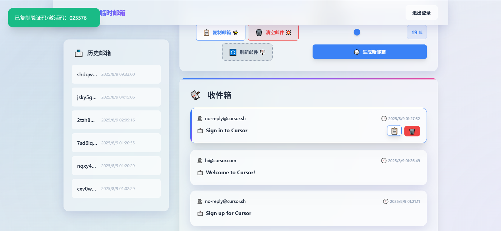

### 用户管理-首页
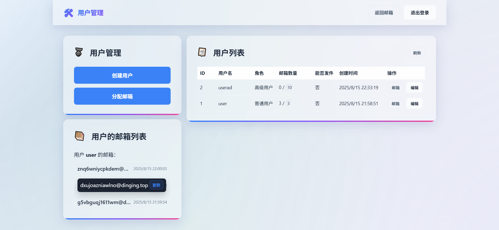

### 分配邮箱
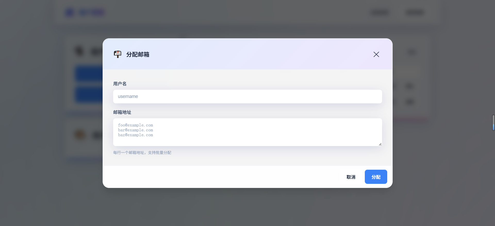
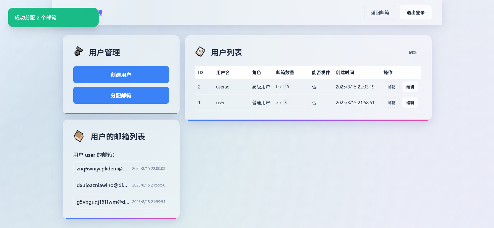

### 编辑用户信息
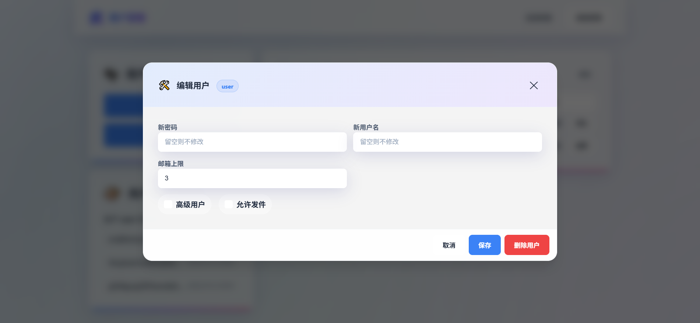

### 用户删除
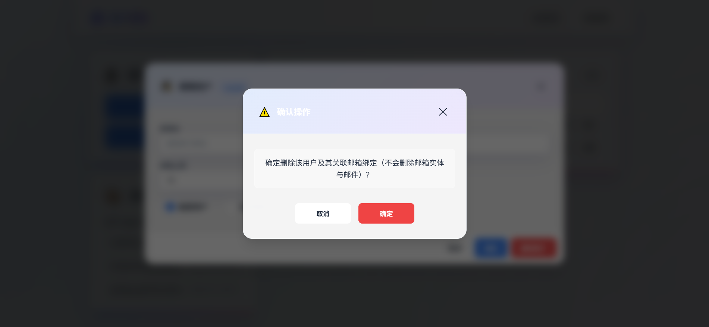

### 上限提示
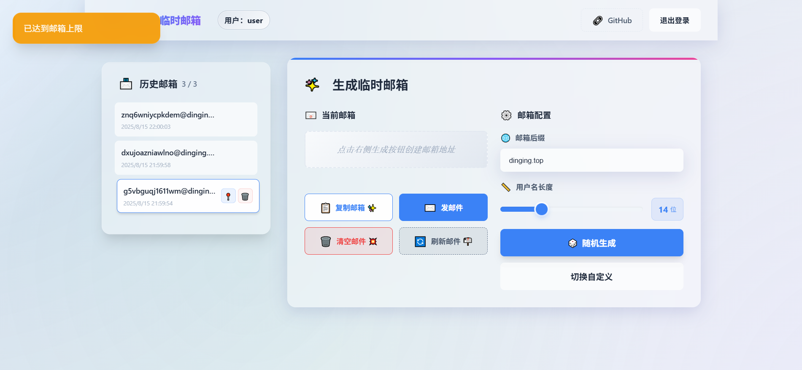

### 发件测试（发送弹窗）
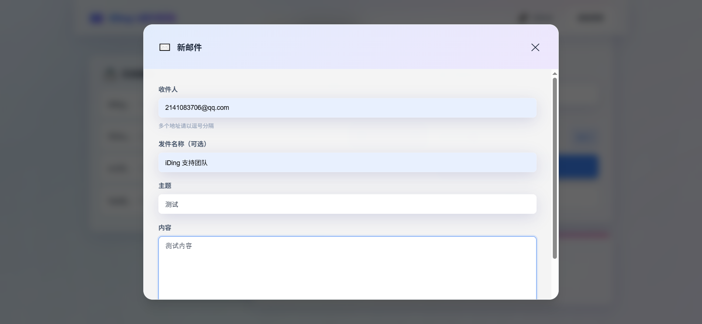

### 发件测试（收件结果）
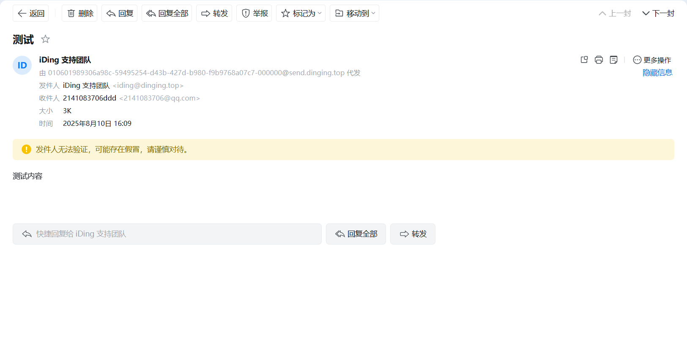

### 邮箱置顶-置顶效果
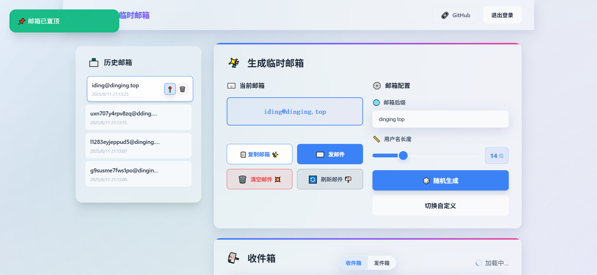

## 📱 手机端展示

### 手机端首页与登录

  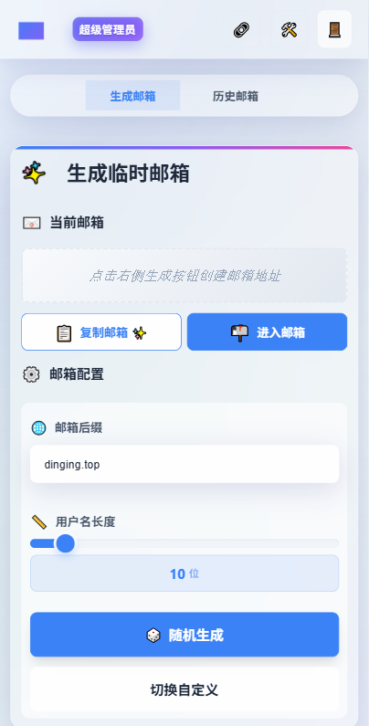
  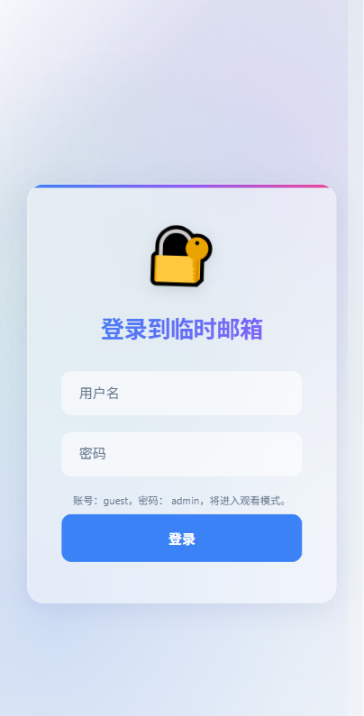

### 手机端生成与历史

  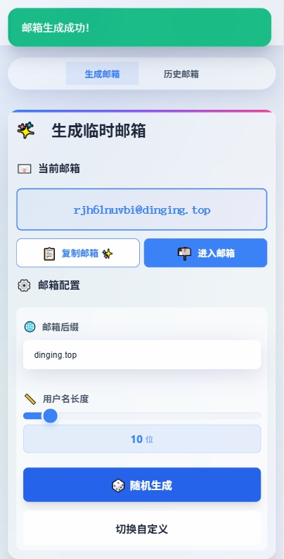
  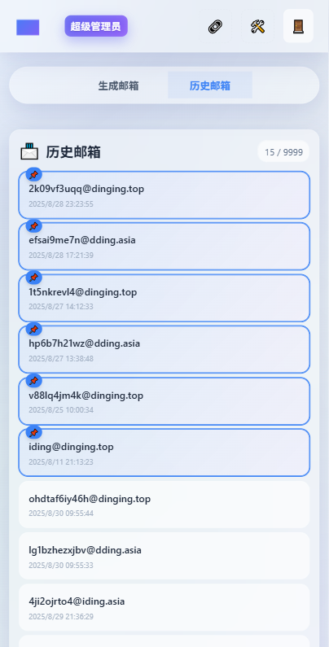

### 手机端发件与自定义

  
  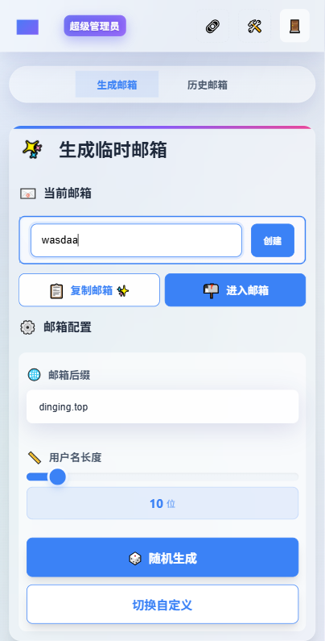

### 手机端发送邮件与邮件详情

  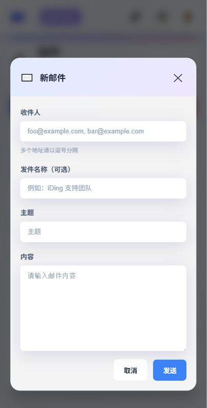
  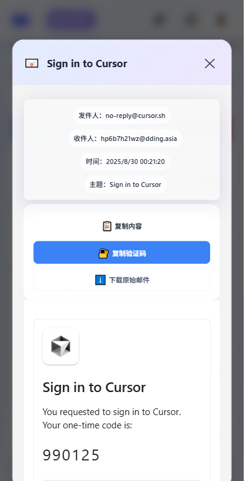

### 邮箱首页
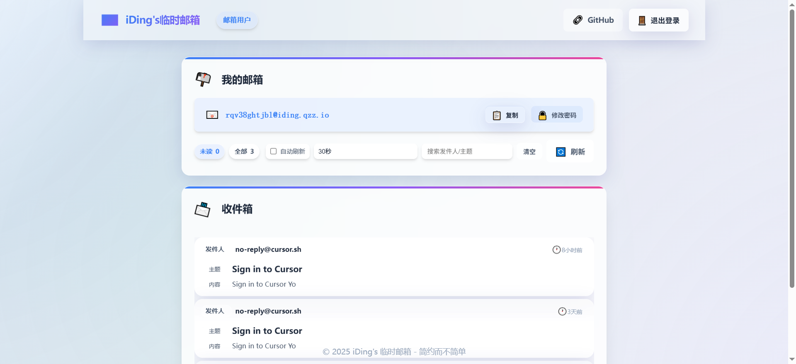

